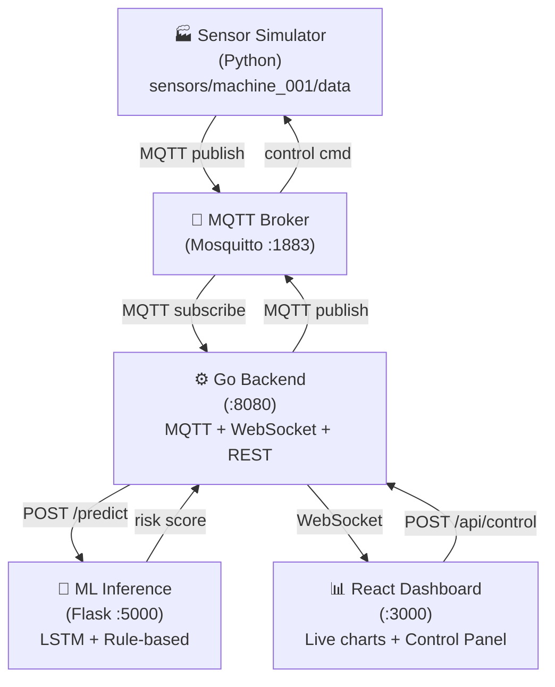

# IoT Predictive Maintenance Platform

Real-time equipment monitoring with ML-based failure prediction — combining Go, Python, and React in a fully containerized stack.

A sensor simulator generates realistic machine telemetry (temperature, vibration, pressure) with progressive degradation. An LSTM model predicts failures 10 readings in advance. Operators see live charts and can trigger failure scenarios manually.

## Architecture



## What's inside

| Component | Technology | Purpose |
|---|---|---|
| **Simulator** | Python, paho-mqtt | Sensor telemetry with degradation algorithm |
| **ML Training** | TensorFlow/Keras, LSTM | Failure prediction model (3-layer LSTM) |
| **ML Inference** | Flask | Rolling 50-reading buffer + rule-based hybrid |
| **Backend** | Go, gorilla/websocket | MQTT subscriber, ML caller, WebSocket broadcaster |
| **Frontend** | React 19, Recharts, Tailwind | Live dashboard + manual control panel |
| **Broker** | Mosquitto | Pub/Sub message bus |

**Hybrid risk scoring:** `final_risk = max(ml_score, rule_based_score)` — ML catches temporal patterns, rules catch instant threshold violations.

## Quick start

```bash
# Start all services
docker compose up -d

# Open dashboard
open http://localhost:3000
```

The simulator starts automatically. The ML service needs ~50 sensor readings to fill its buffer before predictions appear — this takes about 2 minutes.

> **Note:** The trained ML model (~1.6MB) is distributed via GitHub Releases, not included in the image. The container downloads it on first startup. See [GITHUB-RELEASE.md](GITHUB-RELEASE.md) for model versioning.

## Manual control

The dashboard includes a control panel to simulate failure scenarios without waiting for natural degradation:

| Scenario | Temperature | Vibration | Pressure |
|---|---|---|---|
| Normal | 70°C | 0.5 mm/s | 100 PSI |
| Warning | 82°C | 0.85 mm/s | 105 PSI |
| Critical | 92°C | 1.2 mm/s | 115 PSI |
| Failure | 98°C | 1.5 mm/s | 120 PSI |

Sensors can also be controlled individually via sliders.

## ML model

3-layer LSTM trained on 100 synthetic degradation cycles with 7 failure scenarios (gradual degradation, temperature spikes, vibration spikes, pressure drops, multi-failure).

```
LSTM(128) → Dropout(0.3) → LSTM(64) → Dropout(0.3) → LSTM(32) → Dropout(0.2) → Dense(16) → Dense(1, sigmoid)
```

Input: 50-timestep sequences × 3 features (temperature, vibration, pressure), MinMax-scaled.  
Output: Failure probability within next 10 readings.

## Further reading

- [APPLIKATION.md](APPLIKATION.md) — Full component documentation, data structures, API endpoints
- [DOCKER.md](DOCKER.md) — Docker setup details
- [GITHUB-RELEASE.md](GITHUB-RELEASE.md) — ML model versioning and release workflow

## License

MIT — see [LICENSE](LICENSE)
